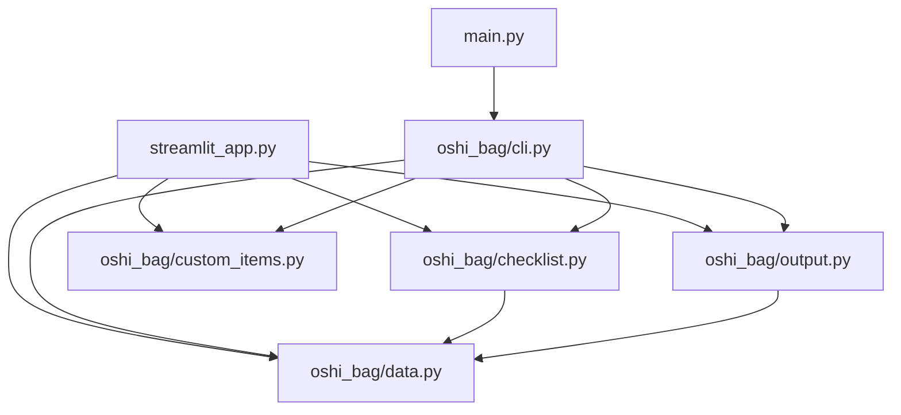

# Oshi Bag Checker 詳細設計書

最終更新: 2026-06-20
バージョン: 1.0（分割構成版）

---

## 1. 本書の位置づけ

基本設計を受け、各モジュールの関数仕様・引数・戻り値・処理ロジック、および不具合修正の詳細を実装レベルで定義する。

---

## 2. モジュール別 詳細仕様

### 2.1 oshi_bag/data.py

持ち物マスタとラベルを定義する定数モジュール。関数は持たない。

| 定数 | 型 | 説明 |
|------|----|------|
| BASE_ITEMS | list[str] | 基本持ち物9点 |
| EVENT_ITEMS | dict[str, list[str]] | live/stage/meet/online ごとの持ち物 |
| WEATHER_ITEMS | dict[str, list[str]] | sunny/rainy ごとの持ち物 |
| TEMPERATURE_ITEMS | dict[str, list[str]] | normal（空）/hot/cold ごとの持ち物 |
| TRAVEL_ITEMS | list[str] | 遠征用持ち物10点 |
| MEMO_ITEMS | list[str] | 末尾メモ3点 |
| EVENT_LABELS / WEATHER_LABELS / TEMPERATURE_LABELS | dict[str, str] | キー→日本語表示 |

> MEMO_ITEMS は従来 streamlit_app と main に直書きされていた内容を data.py に集約し、画面・CLI・txtで共通化した。

### 2.2 oshi_bag/checklist.py

| 関数 | 引数 | 戻り値 | 処理 |
|------|------|--------|------|
| remove_duplicates(items) | items: list[str] | list[str] | 出現順を保ち重複を除去 |
| create_checklist(event_type, weather_type, temperature_type, is_travel, custom_items=None) | キー文字列＋bool＋list | list[str] | 基本→現場→天気→気温→遠征→自由追加の順に集約し重複除去 |

**create_checklist のロジック**

```
checklist = []
checklist += BASE_ITEMS
checklist += EVENT_ITEMS[event_type]
checklist += WEATHER_ITEMS[weather_type]
checklist += TEMPERATURE_ITEMS[temperature_type]
if is_travel:        checklist += TRAVEL_ITEMS
if custom_items:     checklist += custom_items
return remove_duplicates(checklist)
```

custom_items はオプション引数（既定 None）。CLI・Webの双方から渡せる。

### 2.3 oshi_bag/custom_items.py（新機能）

| 関数 | 引数 | 戻り値 | 処理 |
|------|------|--------|------|
| parse_custom_items(raw_text) | raw_text: str \| None | list[str] | 改行・カンマで分割→trim→空除去→重複除去 |

**処理ロジック**

1. raw_text が空／None なら空リストを返す
2. 改行コードを `\n` に統一して改行で分割
3. 各行を全角カンマ「、」も半角「,」に変換してカンマ分割
4. 各要素を strip し、空でなく未登録のものだけ追加

入力例 `"推しのぬいぐるみ\nお守り、サイリウム"` → `["推しのぬいぐるみ", "お守り", "サイリウム"]`

### 2.4 oshi_bag/output.py

| 関数 | 引数 | 戻り値 | 処理 |
|------|------|--------|------|
| create_output_text(event_type, weather_type, temperature_type, is_travel, checklist) | キー＋bool＋list | str | 条件→持ち物→メモを整形した複数行テキスト |
| save_output(text) | text: str | Path | output/checklist_<日時>.txt に保存しパスを返す |

create_output_text は checklist（生成済みの最終リスト）を受け取るため、**自由追加分は既に checklist に含まれており、txtにも自動的に反映**される。MEMO_ITEMS を末尾に付与する。

### 2.5 oshi_bag/cli.py

| 関数 | 引数 | 戻り値 | 処理 |
|------|------|--------|------|
| select_option(title, options) | str, dict | str（選択キー） | 番号入力で選択肢を1つ選ばせる |
| ask_yes_no(message) | str | bool | y/n を受け取る |
| ask_custom_items() | なし | list[str] | 自由追加の入力を受け取り parse_custom_items に渡す |
| run_cli() | なし | なし | 質問→生成→表示→保存確認の流れ |

### 2.6 main.py

`oshi_bag.cli.run_cli` を呼ぶだけの薄い入口。`if __name__ == "__main__":` でのみ起動。

### 2.7 streamlit_app.py

画面構築と状態管理を担当。ロジックは oshi_bag を呼ぶ。

**処理フロー**

1. ページ設定・CSS・タイトル・説明を表示
2. `st.form` 内に 現場/天気/気温（3列）・遠征チェック・自由追加 text_area・送信ボタンを配置
3. 送信時（submitted=True）:
   - `parse_custom_items(custom_text)` で自由追加を整形
   - `create_checklist(...)` で生成
   - `create_output_text(...)` で出力テキスト生成
   - 結果一式を `st.session_state["checklist_result"]` に保存
4. 表示判定: `st.session_state.get("checklist_result")` の有無で分岐
   - None → 案内メッセージ
   - あり → 条件・持ち物チェック・メモチェック・ダウンロード・作り直しボタン
5. 「作り直す」ボタンで session_state を削除し `st.rerun()`

---

## 3. 不具合修正の詳細（BUG-01）

### 3.1 修正前の問題コード（要点）

```python
if submitted:        # フォーム送信した瞬間だけ True
    ...
    for item in checklist:
        st.checkbox(item, key=f"item_{item}")
    ...
else:
    st.info("条件を選んで...")   # チェック操作の再実行でここに来てしまう
```

### 3.2 原因

Streamlit はウィジェット操作のたびにスクリプトを先頭から再実行する。`st.form_submit_button` の戻り値はフォーム送信時のみ True で、チェックボックス操作による再実行では False になる。表示判定を submitted のみで行っていたため、チェックすると else 分岐（初期画面）に落ちていた。

### 3.3 修正方針

生成結果を `st.session_state` に保存し、表示は「保存済み結果の有無」で判定する。チェックボックスには `key` を付け、状態が再実行をまたいで保持されるようにする。

### 3.4 修正後コード（要点）

```python
if submitted:
    ...
    st.session_state["checklist_result"] = {
        "event_type": event_type, "weather_type": weather_type,
        "temperature_type": temperature_type, "is_travel": is_travel,
        "checklist": checklist, "output_text": output_text,
    }

result = st.session_state.get("checklist_result")
if result is None:
    st.info("条件を選んで...")
else:
    # 条件・持ち物チェック・メモチェック・DL・作り直し
    ...
```

### 3.5 確認観点

- 作成後にチェックボックスを操作してもリストが消えないこと
- チェック状態が再実行後も保持されること
- 「作り直す」でリセットされ、初期案内に戻ること

---

## 4. 自由追加機能の詳細（FR-12）

### 4.1 入力（Web）

`st.text_area` で改行／カンマ区切りの自由入力を受け取る。placeholderで記入例を提示。

### 4.2 入力（CLI）

`ask_custom_items()` がカンマ区切り入力を受け取る。未入力なら追加なし。

### 4.3 反映経路

入力 → `parse_custom_items` → `create_checklist(..., custom_items)` → 生成リストに含まれる → `create_output_text` が同リストを整形 → **画面表示・txtダウンロードの両方に反映**。

### 4.4 テスト結果（実施済み）

| 観点 | 結果 |
|------|------|
| 改行・全角/半角カンマ混在の分割 | OK |
| 前後空白の除去 | OK |
| 重複（自由追加と既存持ち物、自由追加同士）の除去 | OK |
| txt出力への反映 | OK |
| CLIエンドツーエンド（自由追加→表示） | OK |

---

## 5. エラー処理・境界条件

| 箇所 | 条件 | 挙動 |
|------|------|------|
| parse_custom_items | 入力なし／None | 空リストを返す（追加なし） |
| TEMPERATURE_ITEMS["normal"] | 追加持ち物が空 | 何も足さない（正常） |
| save_output | output フォルダ無し | mkdir(exist_ok=True) で作成 |
| select_option | 範囲外・非数字 | 再入力を促す |
| ask_yes_no | y/n 以外 | 再入力を促す |

---

## 6. 依存関係図


